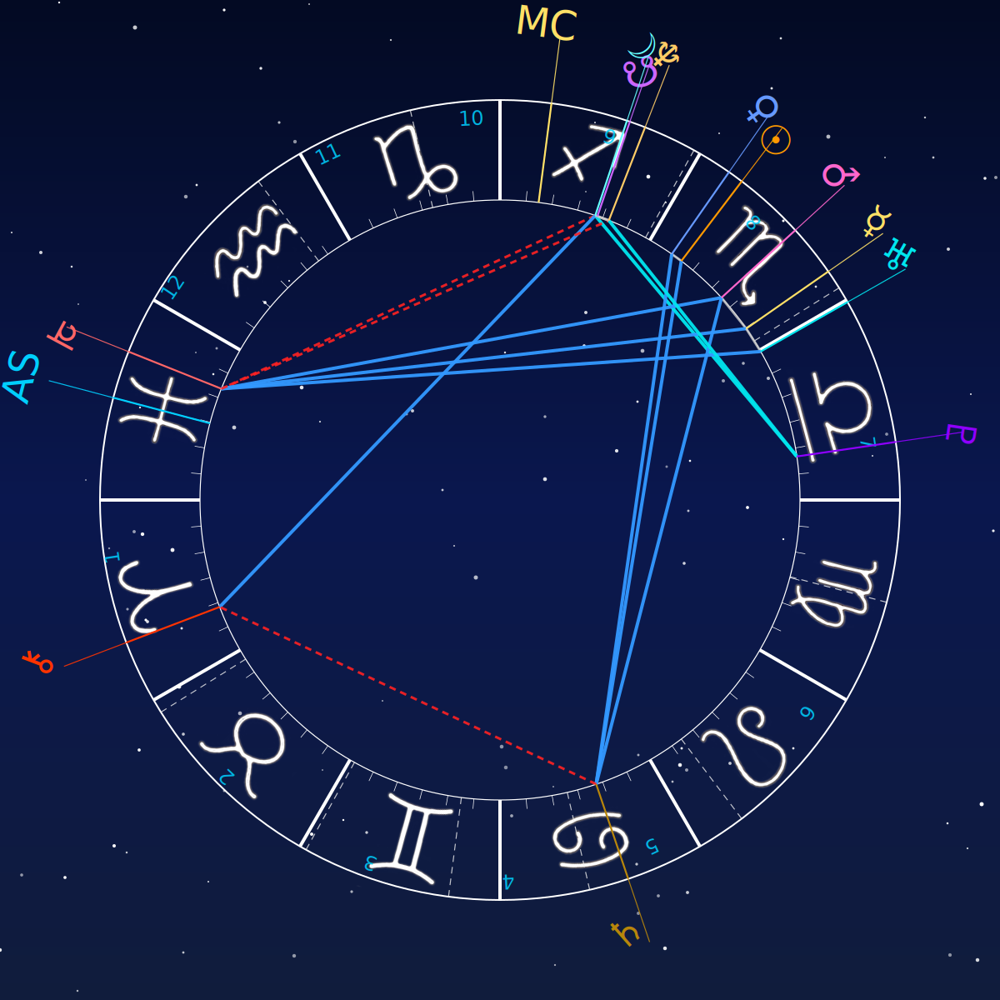

# AstroSource - IA Astrologue Créative

## 🌟 Vision du Projet

AstroSource explore l'intersection fascinante entre l'astrologie et l'intelligence artificielle créative. Ce projet imagine une IA capable d'interpréter les thèmes astrologiques et de les transformer en œuvres d'art **visuelles et sonores** uniques.

## 🎨 Aperçu Visuel

*Découvrez la magie d'AstroSource en images*

### 📊 Carte Astrale Générée

*Carte astrale interactive avec positions planétaires précises*

### 🎨 Art Généré par IA

*Œuvre d'art unique générée à partir d'un thème astral - Création originale Gaby*

> **✨ De votre date de naissance à une œuvre d'art unique en quelques secondes !**

## 🎨 Concept Principal

### Galerie AI

Génération d'images artistiques basées sur :

- Positions planétaires
- Maisons astrologiques
- Aspects et transits
- Énergies du thème natal

### Resin - IA Avancée

Approche évoluée utilisant des images de référence, similaire à un peintre travaillant d'après modèle pour créer des interprétations plus précises et nuancées.

## 🖼️ Galerie d'Œuvres

Ce repository contient une collection d'œuvres d'art générées par IA basées sur des interprétations astrologiques. Chaque image est une création originale née de l'analyse de données célestes.

**Toutes les images présentes sont des créations originales** générées par le système AstroSource et peuvent être librement partagées et étudiées.

## 🚀 État Actuel

**Prototype conceptuel en développement** - Ce projet représente une exploration créative et technique avec un potentiel énorme.

### ✅ Fonctionnalités Implémentées

- Interface utilisateur avec design cosmique
- Structure de galerie par catégories
- Documentation conceptuelle complète
- Architecture React modulaire

### 🔮 Vision Future

- Intégration d'IA générative (Stable Diffusion, DALL-E)
- Système d'interprétation astrologique automatisé
- Création d'œuvres personnalisées basées sur dates de naissance
- API d'éphémérides astronomiques

## 🌙 Philosophie

Ce projet questionne la relation entre technologie et spiritualité, entre données astronomiques et expression artistique. Il représente une tentative de donner une forme visuelle aux énergies astrologiques.

## 📁 Structure

```
frontend/          # Interface React
backend/           # API et pipeline de génération
resin/            # Concept IA avancée avec références
data/             # Données utilisateurs (non incluses)
docs/             # Documentation du projet
```

**Note importante** : Les images générées et les données utilisateurs ne sont pas incluses dans ce repository pour des raisons de taille et de confidentialité.

## 🎨 Inspirations & Évolution

### Base Technique

- **Kerykeion** : Inspiration pour la génération SVG des cartes du ciel
- **Innovation personnelle** : Développement d'une approche artistique unique
- **Fichiers SVG personnalisés** : `data/roue.svg/theme_*.svg`

### Vision Collaborative

Ce projet aspire à rassembler une communauté de développeurs créatifs pour :

- **Multiplier les modèles** de cartes du ciel
- **Explorer différents formats** de visualisation
- **Innover en art astrologique** numérique
- **Fusionner expertise technique** et vision artistique

## 🤝 Contribution

**Ce projet recherche activement des collaborateurs créatifs !**

### Domaines d'innovation recherchés :

- **Développeurs** : Nouveaux algorithmes de visualisation astrologique
- **Designers** : Formats innovants de cartes du ciel
- **Artistes numériques** : Styles visuels révolutionnaires
- **Experts SVG/Canvas** : Optimisation et nouvelles techniques

### Idées de collaboration :

- Bibliothèque de modèles de cartes du ciel
- Formats interactifs et animés
- Styles artistiques par époque/culture
- Integration VR/AR pour l'astrologie immersive

## 📞 Contact

Intéressé par le projet ? N'hésitez pas à contribuer, poser des questions ou proposer des améliorations !

## � Installation

### Prérequis

```bash
# Système requis
- Python 3.9+
- Node.js 16+
- GPU NVIDIA (recommandé) ou CPU puissant
- 8GB RAM minimum
```

### Installation rapide

```bash
# 1. Cloner le projet
git clone https://github.com/Gaby-Ridaya/AstroSource.git
cd AstroSource

# 2. Installer l'environnement Python
python -m venv venv
source venv/bin/activate  # Linux/Mac
# ou venv\Scripts\activate  # Windows
pip install -r requirements.txt

# 3. Installer les dépendances frontend
cd frontend
npm install
cd ..

# 4. Télécharger les modèles IA (optionnel pour démo)
# Les modèles ne sont pas inclus pour réduire la taille du repo
# ./scripts/download-models.sh

# 5. Démarrer l'application
./start_astrosource.sh

# 6. Ouvrir dans le navigateur
# Frontend: http://localhost:5173
# API: http://localhost:8000
```

### 📦 Composants non inclus dans ce repository

Pour réduire la taille, certains éléments sont exclus :

- **Modèles IA** (`models/`) - 2.4 GB

  - Téléchargeables séparément
  - Script d'installation fourni

- **Environnement Python** (`venv/` ou `Boogy/`)

  - Recréé automatiquement avec `pip install`

- **Galerie complète** (`resin/`, `data/images/`)
  - Images de démonstration incluses
  - Nouvelles images générées localement

## 🎨 Génération d'Images

Les images sont générées automatiquement via :

- **Stable Diffusion XL** (backend local)
- **OpenAI DALL-E** (API)

## 🎵 Créations Audio

Le projet inclut également une dimension sonore innovante :

- **Compositions musicales** basées sur les thèmes astrologiques
- **Harmonies planétaires** et rythmes des aspects
- **Ambiances par signe** du zodiaque

Voir `AUDIO.md` pour plus de détails sur les créations sonores.

**Note créative** : Chaque œuvre visuelle et sonore est unique et reflète l'interprétation artistique des données astrologiques par l'IA.

Voir `IMAGES.md` pour plus de détails sur la gestion des assets visuels.

## 📄 Licence

Ce projet est sous licence MIT. Voir le fichier [LICENSE](LICENSE) pour plus de détails.

### Créations Artistiques

- **Images générées** : Libres d'utilisation (créations originales)
- **Compositions audio** : Créations originales sous licence MIT
- **Code source** : Licence MIT

---

_"Transformer les données célestes en art terrestre"_

**Note importante :** Ce projet est partagé dans l'espoir d'inspirer et de rassembler une communauté autour de cette vision unique. Toute contribution, même minime, est la bienvenue !
